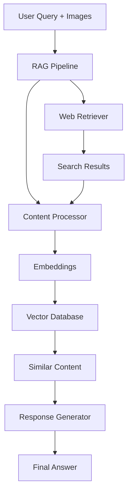

# Design Document

## Overview

The multimodal RAG pipeline is a straightforward system that processes text and images together to answer user questions. It retrieves current information from websites and combines it with the user's input to provide comprehensive answers.

The system works in three simple steps: **Retrieve** → **Process** → **Generate**. This keeps the architecture simple while still handling both text and images effectively.

## Architecture

### Simple Architecture Flow



### Core Components

The system has just 4 main components:

1. **Web Retriever**: Searches and scrapes websites for relevant content
2. **Content Processor**: Handles text and images, creates embeddings
3. **Vector Database**: Stores and searches embeddings
4. **Response Generator**: Creates final answers using retrieved context

## Components and Interfaces

### 1. Web Retriever

**Purpose**: Gets relevant content from websites based on user queries.

**Key Functions**:
```python
class WebRetriever:
    def search_and_scrape(self, query: str) -> List[WebContent]
    def extract_text_and_images(self, url: str) -> ContentPair
```

**What it does**:
- Searches Google/Bing for relevant websites
- Scrapes text and images from found pages
- Returns clean content ready for processing

### 2. Content Processor

**Purpose**: Converts text and images into searchable embeddings.

**Key Functions**:
```python
class ContentProcessor:
    def process_text(self, text: str) -> TextEmbedding
    def process_image(self, image: Image) -> ImageEmbedding
    def combine_embeddings(self, text_emb, image_emb) -> CombinedEmbedding
```

**What it does**:
- Cleans up text (removes HTML, fixes formatting)
- Resizes images to standard format
- Creates embeddings using pre-trained models
- Combines text and image embeddings when both are present

### 3. Vector Database

**Purpose**: Stores embeddings and finds similar content quickly.

**Key Functions**:
```python
class VectorDB:
    def store(self, embedding: Embedding, metadata: dict) -> None
    def search(self, query_embedding: Embedding, top_k: int) -> List[Match]
```

**What it does**:
- Saves embeddings with source information
- Finds most similar content for a given query
- Returns results with similarity scores

### 4. Response Generator

**Purpose**: Creates final answers using retrieved information.

**Key Functions**:
```python
class ResponseGenerator:
    def generate_answer(self, query: str, context: List[Match]) -> str
    def add_citations(self, answer: str, sources: List[Source]) -> str
```

**What it does**:
- Takes user query and similar content
- Uses language model to create comprehensive answer
- Adds source citations to show where information came from

## Data Models

### Simple Data Structures

```python
@dataclass
class UserQuery:
    text: str
    images: List[str]  # image file paths or URLs

@dataclass
class WebContent:
    url: str
    text: str
    images: List[str]
    timestamp: str

@dataclass
class Embedding:
    vector: List[float]
    content_type: str  # "text", "image", or "combined"
    source_url: str
    content: str

@dataclass
class SearchResult:
    content: str
    source_url: str
    similarity_score: float
```

### Storage

We'll use a simple vector database (like ChromaDB or FAISS) that stores:
- Embedding vectors
- Original content (text or image description)
- Source URLs
- Timestamps

No complex database schema needed - just key-value storage with vector search capabilities.

## Error Handling

### Simple Error Strategy

1. **Web scraping fails**: Try 2-3 different URLs, if all fail, use existing knowledge
2. **Image processing fails**: Continue with text-only, show warning to user
3. **No search results found**: Tell user no current info found, provide general answer
4. **Model errors**: Return error message asking user to try again

### Basic Error Handling

```python
def safe_web_search(query: str) -> List[WebContent]:
    try:
        return search_and_scrape(query)
    except Exception as e:
        print(f"Web search failed: {e}")
        return []  # Return empty list, continue with existing knowledge

def safe_process_image(image_path: str) -> Optional[Embedding]:
    try:
        return process_image(image_path)
    except Exception as e:
        print(f"Image processing failed: {e}")
        return None  # Continue without image
```

## Testing Strategy

### Simple Testing Approach

1. **Unit Tests**: Test each component separately
   - Web scraping with mock websites
   - Text/image processing with sample data
   - Embedding generation with known inputs
   - Response generation with mock context

2. **Integration Tests**: Test the complete pipeline
   - Submit test query with text and image
   - Verify web content is retrieved
   - Check embeddings are created and stored
   - Validate final response includes citations

3. **Manual Testing**: 
   - Try different types of queries (text-only, image-only, combined)
   - Test with various websites and content types
   - Verify response quality and source accuracy

### Test Examples

```python
def test_web_retrieval():
    query = "latest AI developments"
    results = web_retriever.search_and_scrape(query)
    assert len(results) > 0
    assert all(result.url.startswith('http') for result in results)

def test_multimodal_processing():
    text = "What is this image about?"
    image = "test_image.jpg"
    response = rag_pipeline.process_query(text, [image])
    assert "based on the image" in response.lower()
    assert len(response) > 50  # Reasonable response length
```