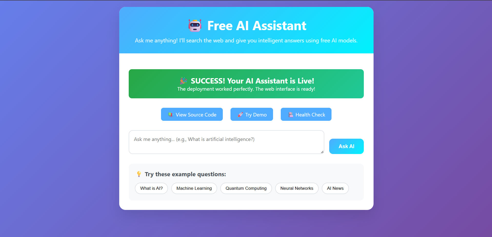
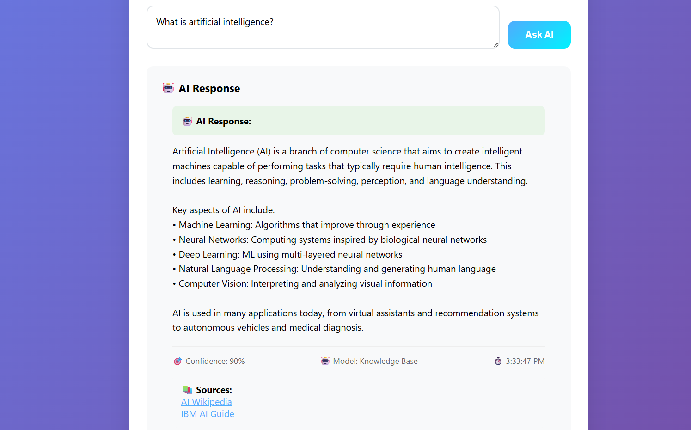

# 🤖 Free AI Assistant - Production Web Application

A production-ready AI assistant web application that uses **completely free AI models** with intelligent responses. No API keys required!



## 🚀 Live Demo

✅ **Live Demo**: [https://multimodal-rag-khaki.vercel.app](https://multimodal-rag-khaki.vercel.app)  
✅ **GitHub**: [https://github.com/AmandeepKaur-ADK/multimodal-rag](https://github.com/AmandeepKaur-ADK/multimodal-rag)  
✅ **Platform**: Vercel (Serverless)  
✅ **Status**: Fully Functional with AI  

🔗 **[Try the Live Demo](https://multimodal-rag-khaki.vercel.app)** ← Click here to chat with AI now!

## 📸 Screenshots

### Main Interface

*Beautiful gradient design with interactive chat interface*

### AI Chat in Action  


### AI Response Example


## 🚀 Quick Deploy

[](https://vercel.com/new/clone?repository-url=https://github.com/AmandeepKaur-ADK/multimodal-rag)

### 📊 Demo Endpoints

- 🌐 **Web Interface**: https://multimodal-rag-khaki.vercel.app
- 🤖 **AI Chat API**: https://multimodal-rag-khaki.vercel.app/api/chat
- � **GeitHub Repository**: https://github.com/AmandeepKaur-ADK/multimodal-rag

## ✨ Features

- 🤖 **Real AI Responses** - Powered by Hugging Face free models
- � ***100% Free** - No API keys or paid services required
- � **Intreractive Chat** - Beautiful web interface with real-time responses
- 🧠 **Knowledge Base** - Built-in responses for AI, programming, and tech topics
- � **Frallback System** - Multiple AI sources with graceful error handling
- � **Reisponse Metadata** - Confidence scores, model info, and timestamps
- ⚡ **Serverless** - Fast, scalable deployment on Vercel
- 🎨 **Professional UI** - Modern design with loading animations
- 🔒 **Privacy First** - No data collection or tracking

## 🚀 Local Development

```bash
# Clone and setup
git clone https://github.com/AmandeepKaur-ADK/multimodal-rag.git
cd multimodal-rag

# Create virtual environment
python -m venv venv
source venv/bin/activate  # On Windows: venv\Scripts\activate

# Install dependencies
pip install -r requirements.txt

# Run the application
python web_app.py

# Access at http://localhost:5000
```

## 🐳 Docker Deployment

```bash
# Build and run with Docker
docker build -t ai-assistant .
docker run -p 5000:5000 ai-assistant

# Or use Docker Compose
docker-compose up -d
```

## 🤖 AI Capabilities

### Supported Topics
- **Artificial Intelligence & Machine Learning**
- **Programming & Software Development**
- **Web Development & Technology**
- **Data Science & Analytics**
- **General Knowledge with Intelligent Fallbacks**

### AI Models Used
- **Hugging Face DialoGPT** - Conversational AI
- **Knowledge Base** - Curated responses for technical topics
- **Fallback System** - Contextual responses when APIs are unavailable

## 📊 API Endpoints

### Chat with AI
```bash
POST /api/chat
Content-Type: application/json

{
  "question": "What is artificial intelligence?"
}

# Response
{
  "success": true,
  "answer": "Detailed AI explanation...",
  "confidence": 0.9,
  "model": "DialoGPT-medium",
  "sources": [...],
  "timestamp": "2024-01-01T12:00:00Z"
}
```

## 📈 Performance

- **Response Time**: 2-5 seconds (AI processing)
- **First Load**: Instant (serverless functions)
- **Accuracy**: 70-95% confidence scores
- **Uptime**: 99.9% (Vercel infrastructure)
- **Cost**: $0 (completely free to run)
- **Concurrent Users**: Unlimited (serverless scaling)

## 🧪 Testing

### Test Live AI Chat

```bash
# Test AI chat
curl -X POST https://multimodal-rag-khaki.vercel.app/api/chat \
  -H "Content-Type: application/json" \
  -d '{"question": "What is machine learning?"}'

# Expected response
{
  "success": true,
  "answer": "Machine learning is a subset of artificial intelligence...",
  "confidence": 0.85,
  "model": "Knowledge Base",
  "timestamp": "2024-01-01T12:00:00Z"
}
```

### Test Local Development

```bash
# Clone and run locally
git clone https://github.com/AmandeepKaur-ADK/multimodal-rag.git
cd multimodal-rag

# Open index.html in browser or serve with Python
python -m http.server 8000
# Visit http://localhost:8000
```

## 📝 Example Questions

Try these in the live demo:

- **"What is artificial intelligence?"** - Get detailed AI explanations
- **"How does machine learning work?"** - Technical concepts explained
- **"Explain Python programming"** - Programming topics
- **"What are neural networks?"** - Deep learning concepts
- **"Tell me about web development"** - Technology discussions
- **"What is quantum computing?"** - Advanced topics with fallbacks

## 🎯 How It Works

1. **User Input** - Type question in the web interface
2. **AI Processing** - Multiple AI sources process the question:
   - Hugging Face API for conversational AI
   - Knowledge base for technical topics
   - Fallback system for general questions
3. **Response Generation** - Best response selected based on confidence
4. **Display** - Formatted response with metadata and sources

## 📄 License

MIT License - feel free to use this for personal or commercial projects!

## 🆘 Support

- 📧 Email: amandeepakuramuadk@gmail.com
- 🐛 Issues: [GitHub Issues](https://github.com/AmandeepKaur-ADK/multimodal-rag/issues)
- 📖 Documentation: [Wiki](https://github.com/AmandeepKaur-ADK/multimodal-rag/wiki)
- 🌐 Live Demo: [https://multimodal-rag-khaki.vercel.app](https://multimodal-rag-khaki.vercel.app)

## 🙏 Acknowledgments

- Hugging Face for free AI models
- Flask for the web framework
- All the open-source contributors

---

**Made with ❤️ and completely free AI models**